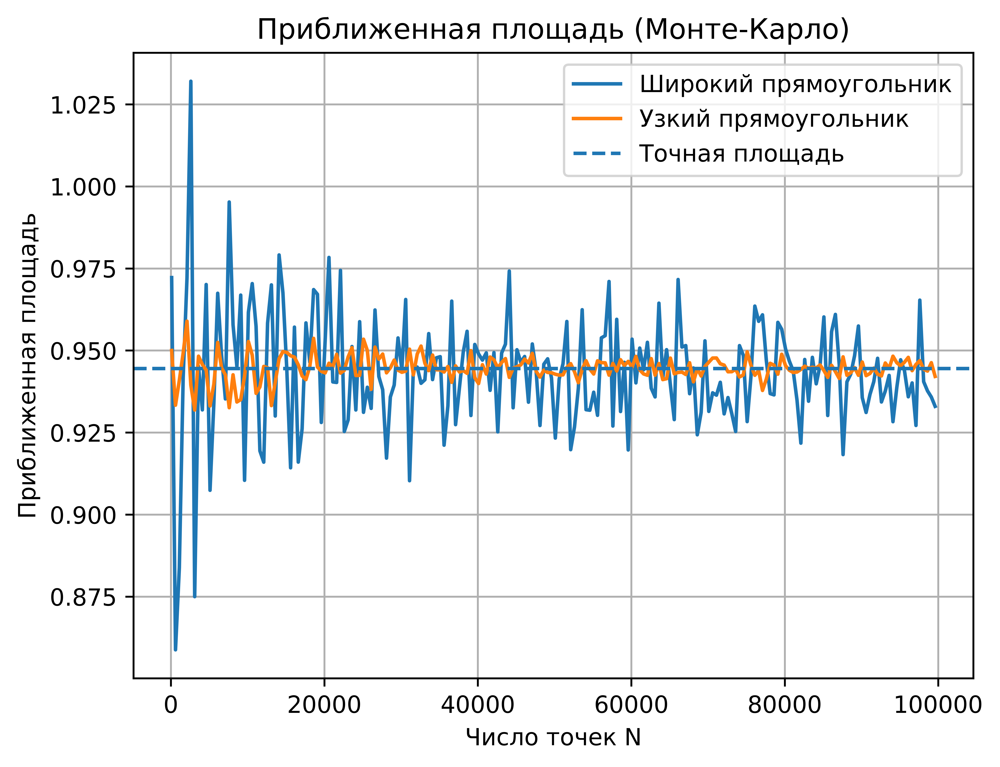
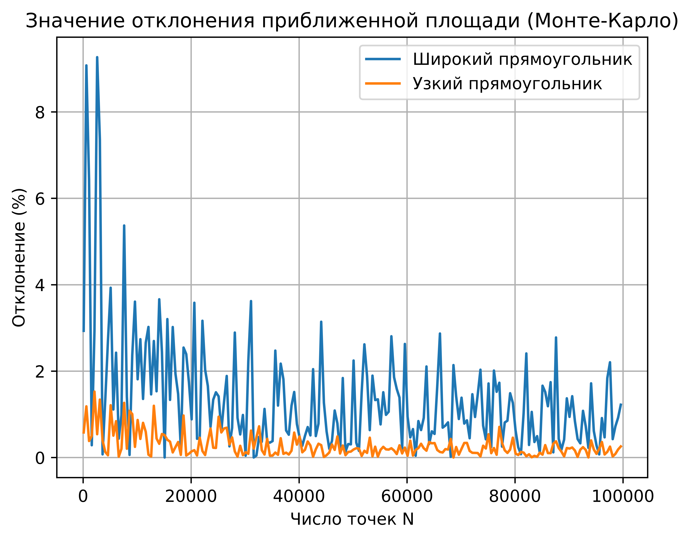

# **Set 3. A1**

**Работа выполнена:** Положенко Виталием, БПИ-247

**ID посылки на Codeforces:** `349268424`

---

## **Код программы на C++ для решения задачи A1i (универсальный, принимает любые входные данные)**

```cpp
#include <cmath>
#include <iostream>
#include <array>
#include <iomanip>
#include <random>

struct Circle {
  double x, y, r;
};

double MonteCarloIntersectionArea(const std::array<Circle, 3>& c,
                                  const bool use_narrow_rect) {
  double x_min = NAN;
  double x_max = NAN;
  double y_min = NAN;
  double y_max = NAN;

  if (use_narrow_rect) {
    x_min = std::max(std::max(c[0].x - c[0].r, c[1].x - c[1].r), c[2].x - c[2].r);
    x_max = std::min(std::min(c[0].x + c[0].r, c[1].x + c[1].r), c[2].x + c[2].r);
    y_min = std::max(std::max(c[0].y - c[0].r, c[1].y - c[1].r), c[2].y - c[2].r);
    y_max = std::min(std::min(c[0].y + c[0].r, c[1].y + c[1].r), c[2].y + c[2].r);
  } else {
    x_min = std::min(std::min(c[0].x - c[0].r, c[1].x - c[1].r), c[2].x - c[2].r);
    x_max = std::max(std::max(c[0].x + c[0].r, c[1].x + c[1].r), c[2].x + c[2].r);
    y_min = std::min(std::min(c[0].y - c[0].r, c[1].y - c[1].r), c[2].y - c[2].r);
    y_max = std::max(std::max(c[0].y + c[0].r, c[1].y + c[1].r), c[2].y + c[2].r);
  }

  if (x_max <= x_min || y_max <= y_min) {
    return 0.0;
  }

  const double s_rec = (x_max - x_min) * (y_max - y_min);

  std::random_device rd;
  std::mt19937_64 gen(rd());
  std::uniform_real_distribution dist_x(x_min, x_max);
  std::uniform_real_distribution dist_y(y_min, y_max);

  constexpr int64_t kTotal = 100000;
  int64_t hits = 0;
  double area_est = 0.0;

  for (int i = 0; i < kTotal; ++i) {
    const double x = dist_x(gen);
    const double y = dist_y(gen);

    bool inside = true;
    for (int k = 0; k < 3; ++k) {
      const double dx = x - c[k].x;
      const double dy = y - c[k].y;
      if (dx * dx + dy * dy > c[k].r * c[k].r) {
        inside = false;
        break;
      }
    }
    if (inside) {
      ++hits;
    }
  }

  area_est = static_cast<double>(hits) / static_cast<double>(kTotal) * s_rec;

  return area_est;
}

int main() {
  std::ios::sync_with_stdio(false);
  std::cin.tie(nullptr);

  std::array<Circle, 3> circles;
  for (int i = 0; i < 3; ++i) {
    std::cin >> circles[i].x >> circles[i].y >> circles[i].r;
  }

  const double area = MonteCarloIntersectionArea(circles, true);

  std::cout << std::fixed << std::setprecision(19) << area << "\n";
  return 0;
}
```

---

## **Код программы на C++ (только для фиксированных данных из условия)**

```cpp
#include <cmath>
#include <iostream>
#include <array>
#include <iomanip>
#include <random>
#include <cstdint>

struct Circle {
  double x, y, r;
};

double MonteCarloIntersectionArea(const std::array<Circle, 3>& c, const bool use_narrow_rect,
                                  const std::int64_t n_points) {
  double x_min = NAN;
  double x_max = NAN;
  double y_min = NAN;
  double y_max = NAN;

  if (use_narrow_rect) {
    x_min = std::max(std::max(c[0].x - c[0].r, c[1].x - c[1].r), c[2].x - c[2].r);
    x_max = std::min(std::min(c[0].x + c[0].r, c[1].x + c[1].r), c[2].x + c[2].r);
    y_min = std::max(std::max(c[0].y - c[0].r, c[1].y - c[1].r), c[2].y - c[2].r);
    y_max = std::min(std::min(c[0].y + c[0].r, c[1].y + c[1].r), c[2].y + c[2].r);
  } else {
    x_min = std::min(std::min(c[0].x - c[0].r, c[1].x - c[1].r), c[2].x - c[2].r);
    x_max = std::max(std::max(c[0].x + c[0].r, c[1].x + c[1].r), c[2].x + c[2].r);
    y_min = std::min(std::min(c[0].y - c[0].r, c[1].y - c[1].r), c[2].y - c[2].r);
    y_max = std::max(std::max(c[0].y + c[0].r, c[1].y + c[1].r), c[2].y + c[2].r);
  }

  if (x_max <= x_min || y_max <= y_min) {
    return 0.0;
  }

  const double s_rec = (x_max - x_min) * (y_max - y_min);

  std::random_device rd;
  std::mt19937_64 gen(rd());
  std::uniform_real_distribution dist_x(x_min, x_max);
  std::uniform_real_distribution dist_y(y_min, y_max);

  std::int64_t hits = 0;

  for (std::int64_t i = 0; i < n_points; ++i) {
    const double x = dist_x(gen);
    const double y = dist_y(gen);

    bool inside = true;
    for (int k = 0; k < 3; ++k) {
      const double dx = x - c[k].x;
      const double dy = y - c[k].y;
      if (dx * dx + dy * dy > c[k].r * c[k].r) {
        inside = false;
        break;
      }
    }
    if (inside) {
      ++hits;
    }
  }

  const double area_est = static_cast<double>(hits) / static_cast<double>(n_points) * s_rec;

  return area_est;
}

int main() {
  std::ios::sync_with_stdio(false);
  std::cin.tie(nullptr);

  std::array<Circle, 3> circles;
  circles[0] = Circle{1, 1, 1};
  circles[1] = Circle{1.5, 2, std::sqrt(5) / 2};
  circles[2] = Circle{2, 1.5, std::sqrt(5) / 2};

  const double s_exact = 0.25 * M_PI + 1.25 * std::asin(0.8) - 1.0;

  std::cout << std::fixed << std::setprecision(6);

  std::cout << "N"
            << "\t"
            << "Area_wide"
            << "\t"
            << "Err_wide_%"
            << "\t"
            << "Area_narrow"
            << "\t"
            << "Err_narrow_%"
            << "\n";

  for (int n = 100; n <= 100000; n += 500) {
    const double area_wide = MonteCarloIntersectionArea(circles, false, n);
    const double area_narrow = MonteCarloIntersectionArea(circles, true, n);

    const double err_wide = std::abs(area_wide - s_exact) / s_exact * 100.0;
    const double err_narrow = std::abs(area_narrow - s_exact) / s_exact * 100.0;

    std::cout << n << "\t" << area_wide << "\t" << err_wide << "\t" << area_narrow << "\t" << err_narrow << "\n";
  }

  return 0;
}
```

---

## **Код программы на Python**

```python
import csv
import math
import random

import matplotlib.pyplot as plt


class Circle:
    def __init__(self, x: float, y: float, r: float):
        self.x = x
        self.y = y
        self.r = r


def MonteCarloIntersectionArea(circles, use_narrow_rect: bool, n: int) -> float:
    if use_narrow_rect:
        x_min = max(circles[0].x - circles[0].r,
                    circles[1].x - circles[1].r,
                    circles[2].x - circles[2].r)
        x_max = min(circles[0].x + circles[0].r,
                    circles[1].x + circles[1].r,
                    circles[2].x + circles[2].r)
        y_min = max(circles[0].y - circles[0].r,
                    circles[1].y - circles[1].r,
                    circles[2].y - circles[2].r)
        y_max = min(circles[0].y + circles[0].r,
                    circles[1].y + circles[1].r,
                    circles[2].y + circles[2].r)
    else:
        x_min = min(circles[0].x - circles[0].r,
                    circles[1].x - circles[1].r,
                    circles[2].x - circles[2].r)
        x_max = max(circles[0].x + circles[0].r,
                    circles[1].x + circles[1].r,
                    circles[2].x + circles[2].r)
        y_min = min(circles[0].y - circles[0].r,
                    circles[1].y - circles[1].r,
                    circles[2].y - circles[2].r)
        y_max = max(circles[0].y + circles[0].r,
                    circles[1].y + circles[1].r,
                    circles[2].y + circles[2].r)

    if x_max <= x_min or y_max <= y_min:
        return 0.0

    s_rec = (x_max - x_min) * (y_max - y_min)

    hits = 0
    for _ in range(n):
        x = random.uniform(x_min, x_max)
        y = random.uniform(y_min, y_max)

        inside = True
        for c in circles:
            dx = x - c.x
            dy = y - c.y
            if dx * dx + dy * dy > c.r * c.r:
                inside = False
                break

        if inside:
            hits += 1

    area_est = hits / n * s_rec
    return area_est


def main():
    circles = [
        Circle(1.0, 1.0, 1.0),
        Circle(1.5, 2.0, math.sqrt(5.0) / 2.0),
        Circle(2.0, 1.5, math.sqrt(5.0) / 2.0),
    ]

    s_exact = 0.25 * math.pi + 1.25 * math.asin(0.8) - 1.0
    print("Точная площадь (подсчитанная по формуле):", s_exact)

    n_vals = list(range(100, 100001, 500))

    wide_areas = []
    narrow_areas = []
    wide_err = []
    narrow_err = []

    wide_rows = []
    narrow_rows = []

    for N in n_vals:
        area_wide = MonteCarloIntersectionArea(
            circles, use_narrow_rect=False, n=N)
        area_narrow = MonteCarloIntersectionArea(
            circles, use_narrow_rect=True, n=N)
        err_wide = abs(area_wide - s_exact) / s_exact * 100.0
        err_narrow = abs(area_narrow - s_exact) / s_exact * 100

        wide_areas.append(area_wide)
        narrow_areas.append(area_narrow)

        wide_rows.append({
            "N": N,
            "area_wide": area_wide,
            "wide_err_percent": err_wide
        })

        narrow_rows.append({
            "N": N,
            "area_narrow": area_narrow,
            "narrow_err_percent": err_narrow
        })

        wide_err.append(err_wide)
        narrow_err.append(err_narrow)

    filename_wide = "monte_carlo_wide.csv"
    with open(filename_wide, "w", newline="", encoding="utf-8") as f:
        writer = csv.DictWriter(
            f,
            fieldnames=["N", "area_wide", "wide_err_percent"]
        )
        writer.writeheader()
        writer.writerows(wide_rows)
    print(f"Результаты широкого прямоугольника сохранены в: {filename_wide}")

    filename_narrow = "monte_carlo_narrow.csv"
    with open(filename_narrow, "w", newline="", encoding="utf-8") as f:
        writer = csv.DictWriter(
            f,
            fieldnames=["N", "area_narrow", "narrow_err_percent"]
        )
        writer.writeheader()
        writer.writerows(narrow_rows)
    print(f"Результаты узкого прямоугольника сохранены в: {filename_narrow}")

    plt.figure()
    plt.plot(n_vals, wide_areas, label="Широкий прямоугольник")
    plt.plot(n_vals, narrow_areas, label="Узкий прямоугольник")
    plt.axhline(s_exact, linestyle="--", label="Точная площадь")
    plt.xlabel("Число точек N")
    plt.ylabel("Приближенная площадь")
    plt.title("Приближенная площадь (Монте-Карло)")
    plt.legend()
    plt.grid(True)

    graph_area_filename = "plot_area.png"
    plt.savefig(graph_area_filename, dpi=1200, bbox_inches="tight")
    print(f"График площади сохранён в {graph_area_filename}")

    plt.show()

    plt.figure()
    plt.plot(n_vals, wide_err, label="Широкий прямоугольник")
    plt.plot(n_vals, narrow_err, label="Узкий прямоугольник")
    plt.xlabel("Число точек N")
    plt.ylabel("Отклонение (%)")
    plt.title("Значение отклонения приближенной площади (Монте-Карло)")
    plt.legend()
    plt.grid(True)

    graph_error_filename = "plot_error.png"
    plt.savefig(graph_error_filename, dpi=1200, bbox_inches="tight")
    print(f"График ошибки сохранён в {graph_error_filename}")

    plt.show()


if __name__ == "__main__":
    main()
```

---

## **Файлы, сгенерированные программой на Python**

* **`monte_carlo_narrow.csv`** - результаты вычислений методом узкого прямоугольника
* **`monte_carlo_wide.csv`** - результаты вычислений методом широкого прямоугольника
* **`plot_area.png`** - график изменения приближённой площади при росте N
* **`plot_error.png`** - график изменения относительной ошибки (%)



График 1. Зависимость приближенной площади пересечения трёх окружностей от числа точек и масштаба прямоугольной области.



График 2. Зависимость относительного отклонения приближенной площади от числа точек для широкого и узкого
прямоугольника.

Увеличение числа точек N приводит к снижению погрешности в обоих методах. При одинаковом количестве случайных точек
метод с узким прямоугольником является значительно более точным и эффективным, поскольку уменьшает площадь, в которую
могут попасть «лишние» точки. Поэтому для задач подобного типа предпочтительно использовать минимально возможный
прямоугольник.