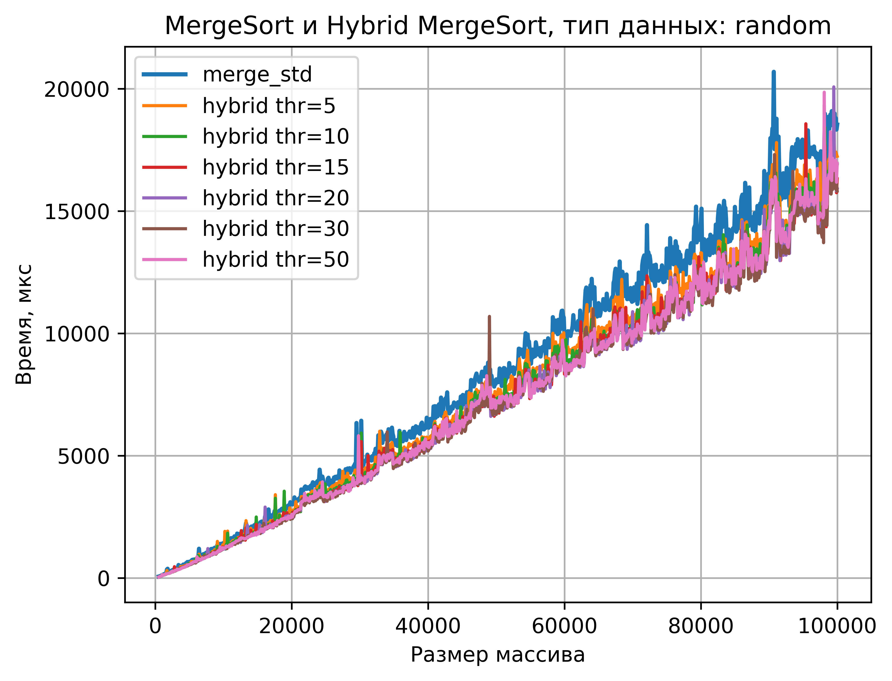
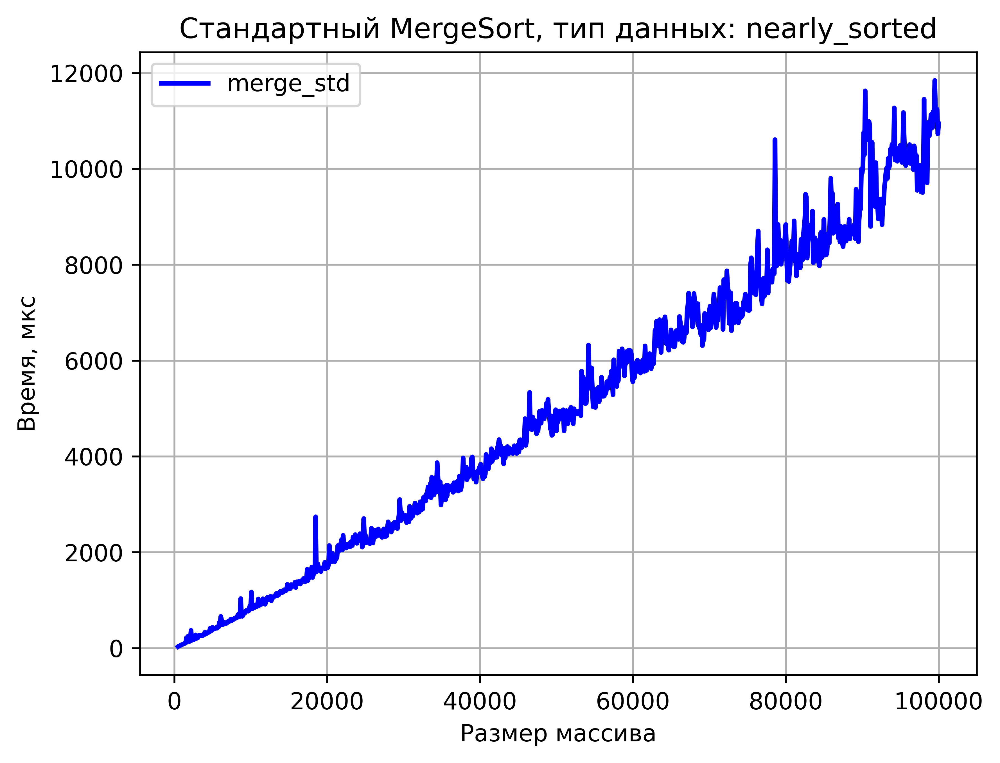
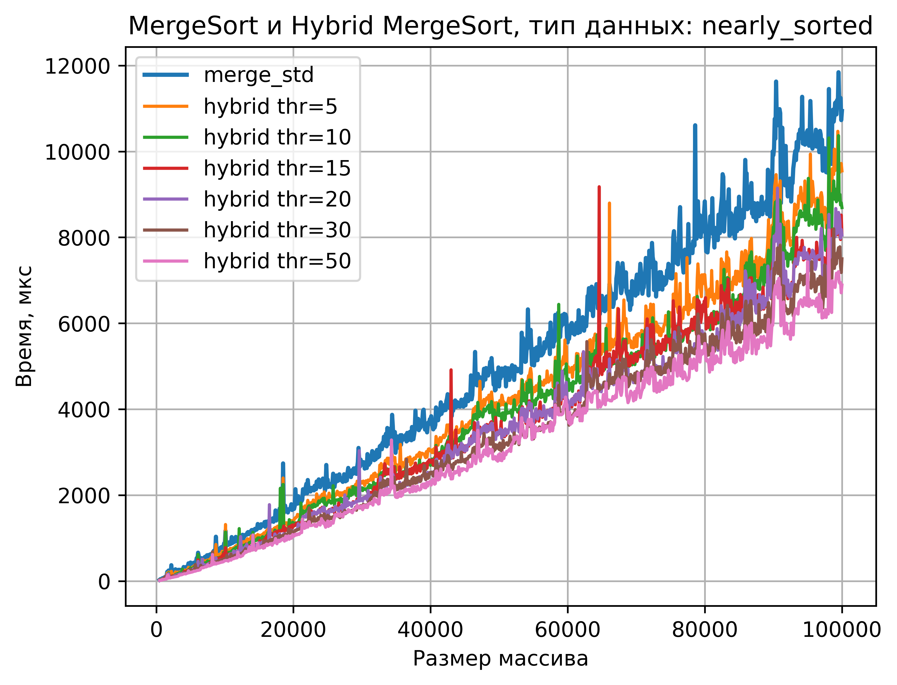
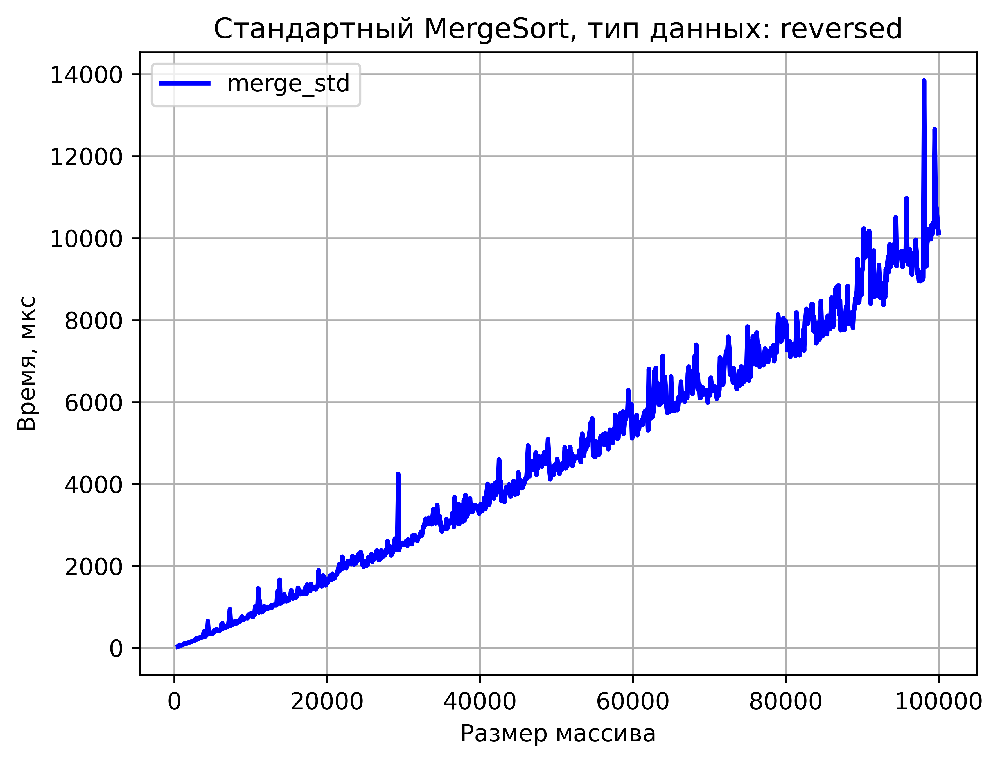
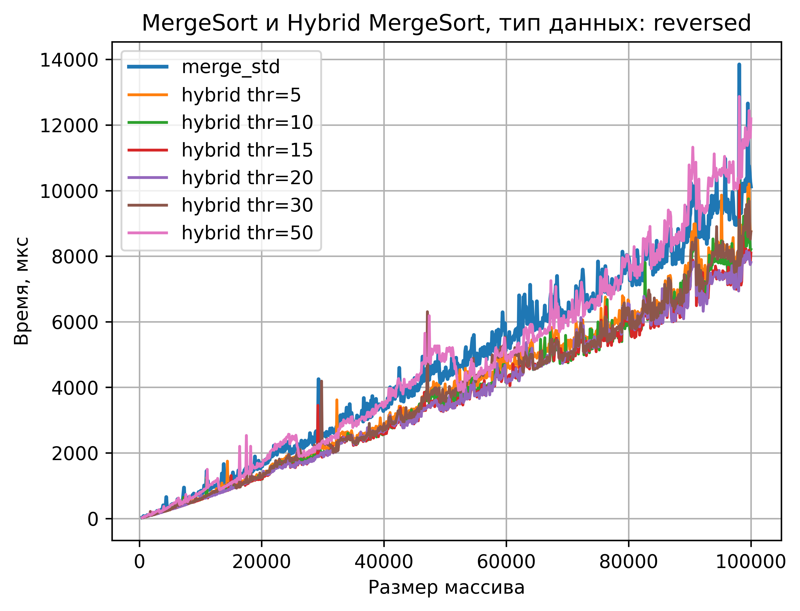

# **Set 3. A2**

**Работа выполнена:** Положенко Виталием, БПИ-247

**ID посылки на Codeforces:** `349338379`

---

## **Реализация Merge + Insertion Sort на C++**

```cpp
#include <vector>
#include <iostream>

constexpr int kThreshold = 15;

template <typename T>
void InsertionSort(std::vector<T> &a, const int left, const int right) {
  for (int i = left + 1; i < right; ++i) {
    T key = a[i];
    int j = i - 1;
    while (j >= left && a[j] > key) {
      a[j + 1] = a[j];
      --j;
    }
    a[j + 1] = key;
  }
}

template <typename T>
void MergeArrays(std::vector<T> &a, std::vector<T> &b, const int left, const int mid, const int right) {
  int i = left;
  int j = mid;
  int k = left;
  while (i < mid && j < right) {
    if (a[i] <= a[j]) {
      b[k++] = a[i++];
    } else {
      b[k++] = a[j++];
    }
  }
  while (i < mid) {
    b[k++] = a[i++];
  }
  while (j < right) {
    b[k++] = a[j++];
  }
  for (int t = left; t < right; ++t) {
    a[t] = b[t];
  }
}

template <typename T>
void MergeSortHybridRec(std::vector<T> &a, std::vector<T> &b, int left, int right) {
  const int len = right - left;
  if (len <= kThreshold) {
    InsertionSort(a, left, right);
    return;
  }
  int mid = left + len / 2;
  MergeSortHybridRec(a, b, left, mid);
  MergeSortHybridRec(a, b, mid, right);
  MergeArrays(a, b, left, mid, right);
}

template <typename T>
void MergeSortHybrid(std::vector<T> &a) {
  if (a.empty()) {
    return;
  }
  std::vector<T> b(a.size());
  MergeSortHybridRec(a, b, 0, a.size());
}

int main() {
  std::ios::sync_with_stdio(false);
  std::cin.tie(nullptr);

  int n = 0;
  std::cin >> n;

  std::vector<int64_t> a(n);
  for (int i = 0; i < n; ++i) {
    std::cin >> a[i];
  }

  MergeSortHybrid(a);

  for (int i = 0; i < n; ++i) {
    if (i) {
      std::cout << ' ';
    }
    std::cout << a[i];
  }

  return 0;
}
```

---

## Класс ArrayGenerator

Класс для подготовки тестовых массивов трёх типов: почти отсортированный, обратно отсортированный и полностью случайный.

### Поля

* `max_size_` - максимальный размер массива (100000).
* `min_val`, `max_val` - диапазон значений (0-6000).
* `base_random`, `base_reversed`, `base_nearly_sorted_` - массивы максимальной длины, из которых затем тестовая подпрограмма берёт подмассивы нужной длины.

### Методы

* **`generateBases()`** - заполняет массивы случайными значениями.

  * `base_random_` - случайные значения в [minVal; maxVal];
  * `base_reversed_` - сортировка `base_random_` по невозрастанию;
  * `base_nearly_sorted_` - сортировка `base_random_` по возрастанию + не более, чем 1000 обменов (почти отсортированный массив).

* **`getArray(Type type, int size)`**

  * возвращает подмассив первых `size` элементов из соответствующего базового массива:

    * `FULLY_RANDOM` → `base_random_`;
    * `REVERSED_SORTED` → `base_reversed_`;
    * `NEARLY_SORTED` → `base_nearly_sorted_`.

## Класс SortTester

Класс для измерения времени работы алгоритмов и записи результатов в CSV файл.

### Поля

* `min_size_`, `max_size_`, `step_` - диапазон и шаг для размеров массивов.
* `repetitions_` - количество повторов для одного набора параметров.
* ссылка на `ArrayGenerator`.

### Метод

* **`runAllToCsv(const std::string &filename)`**

  * перебирает размеры `n` от `min_size_` до `max_size_` с шагом `step_`;
  * для каждого `n` и каждого типа данных (`random`, `reversed`, `nearly_sorted`):

    * **стандартный Merge Sort (`merge_std`)**:

      * `repetitions` раз:
        * берётся массив через `getArray`;
        * измеряется время сортировки (микросекунды);
        * результат записывается в CSV.
    * **гибридный Merge+Insertion (`merge_hybrid`)**:

      * для каждого `threshold` из набора (например, 5, 10, 15, 20, 30, 50):

        * `repetitions` раз:

          * аналогично замер времени и запись в CSV.
  * формат строки:
    `size, data_type, algorithm, threshold, run, time_µs`.

## **Полный код тестовой программы на C++**

```cpp
#include <chrono>
#include <fstream>
#include <random>
#include <vector>

template <typename T>
void MergeArrays(std::vector<T> &a, std::vector<T> &b, const int left, const int mid, const int right) {
  int i = left;
  int j = mid;
  int k = left;
  while (i < mid && j < right) {
    if (a[i] <= a[j]) {
      b[k++] = a[i++];
    } else {
      b[k++] = a[j++];
    }
  }
  while (i < mid) {
    b[k++] = a[i++];
  }
  while (j < right) {
    b[k++] = a[j++];
  }
  for (int t = left; t < right; ++t) {
    a[t] = b[t];
  }
}

template <typename T>
void MergeSortRec(std::vector<T> &a, std::vector<T> &b, int left, int right) {
  if (right - left <= 1) {
    return;
  }
  int mid = left + (right - left) / 2;
  MergeSortRec(a, b, left, mid);
  MergeSortRec(a, b, mid, right);
  MergeArrays(a, b, left, mid, right);
}

template <typename T>
void MergeSort(std::vector<T> &a) {
  if (a.empty()) {
    return;
  }
  std::vector<T> b(a.size());
  MergeSortRec(a, b, 0, a.size());
}

template <typename T>
void InsertionSort(std::vector<T> &a, const int left, const int right) {
  for (int i = left + 1; i < right; ++i) {
    T key = a[i];
    int j = i - 1;
    while (j >= left && a[j] > key) {
      a[j + 1] = a[j];
      --j;
    }
    a[j + 1] = key;
  }
}

template <typename T>
void MergeSortHybridRec(std::vector<T> &a, std::vector<T> &b, int left, int right, int threshold) {
  const int len = right - left;
  if (len <= threshold) {
    InsertionSort(a, left, right);
    return;
  }
  int mid = left + len / 2;
  MergeSortHybridRec(a, b, left, mid, threshold);
  MergeSortHybridRec(a, b, mid, right, threshold);
  MergeArrays(a, b, left, mid, right);
}

template <typename T>
void MergeSortHybrid(std::vector<T> &a, int threshold) {
  if (a.empty()) {
    return;
  }
  std::vector<T> b(a.size());
  MergeSortHybridRec(a, b, 0, a.size(), threshold);
}

class ArrayGenerator {
 public:
  enum class Type { FULLY_RANDOM, REVERSED_SORTED, NEARLY_SORTED };

  ArrayGenerator(const int max_size, const int min_val, const int max_val)
      : max_size_(max_size)
      , min_val_(min_val)
      , max_val_(max_val)
      , rng_(static_cast<uint64_t>(std::chrono::high_resolution_clock::now().time_since_epoch().count())) {
    GenerateBases();
  }

  std::vector<int> GetArray(const Type type, int size) {
    size = std::min(size, max_size_);
    switch (type) {
      case Type::FULLY_RANDOM:
        return {base_random_.begin(), base_random_.begin() + size};
      case Type::REVERSED_SORTED:
        return {base_reversed_.begin(), base_reversed_.begin() + size};
      case Type::NEARLY_SORTED:
        return {base_nearly_sorted_.begin(), base_nearly_sorted_.begin() + size};
    }
    return {};
  }

 private:
  int max_size_;
  int min_val_, max_val_;
  std::mt19937_64 rng_;

  std::vector<int> base_random_;
  std::vector<int> base_reversed_;
  std::vector<int> base_nearly_sorted_;

  void GenerateBases() {
    std::uniform_int_distribution dist(min_val_, max_val_);
    base_random_.resize(max_size_);
    for (int i = 0; i < max_size_; ++i) {
      base_random_[i] = dist(rng_);
    }

    base_reversed_ = base_random_;
    sort(base_reversed_.begin(), base_reversed_.end(), std::greater<int>());

    base_nearly_sorted_ = base_random_;
    sort(base_nearly_sorted_.begin(), base_nearly_sorted_.end());
    const int swaps = std::max(1, max_size_ / 100);
    std::uniform_int_distribution idx(0, max_size_ - 1);
    for (int k = 0; k < swaps; ++k) {
      const int i = idx(rng_);
      if (const int j = idx(rng_); i != j) {
        std::swap(base_nearly_sorted_[i], base_nearly_sorted_[j]);
      }
    }
  }
};

class SortTester {
 public:
  enum class Algorithm { MERGE_STD, MERGE_HYBRID };

  SortTester(ArrayGenerator &gen, const int min_size, const int max_size, const int step, const int repetitions)
      : gen_(gen), min_size_(min_size), max_size_(max_size), step_(step), repetitions_(repetitions) {
  }

  void RunAllToCsv(const std::string &filename) const {
    std::ofstream out(filename);
    out << "size,data_type,algorithm,threshold,iteration,time_µs\n";

    std::vector thresholds = {5, 10, 15, 20, 30, 50};

    for (int n = min_size_; n <= max_size_; n += step_) {
      for (int t = 0; t < 3; ++t) {
        auto type = static_cast<ArrayGenerator::Type>(t);
        std::string type_name = DataTypeToString(type);

        for (int run = 0; run < repetitions_; ++run) {
          std::vector<int> a = gen_.GetArray(type, n);
          auto start = std::chrono::high_resolution_clock::now();
          MergeSort(a);
          auto elapsed = std::chrono::high_resolution_clock::now() - start;
          int64_t msec = std::chrono::duration_cast<std::chrono::microseconds>(elapsed).count();

          out << n << "," << type_name << ",merge_std," << 0 << "," << run << "," << msec << "\n";
        }

        for (int thr : thresholds) {
          for (int run = 0; run < repetitions_; ++run) {
            std::vector<int> a = gen_.GetArray(type, n);
            auto start = std::chrono::high_resolution_clock::now();
            MergeSortHybrid(a, thr);
            auto elapsed = std::chrono::high_resolution_clock::now() - start;
            int64_t msec = std::chrono::duration_cast<std::chrono::microseconds>(elapsed).count();

            out << n << "," << type_name << ",merge_hybrid," << thr << "," << run << "," << msec << "\n";
          }
        }
        out.flush();
      }
    }
  }

 private:
  ArrayGenerator &gen_;
  int min_size_, max_size_, step_, repetitions_;

  static std::string DataTypeToString(const ArrayGenerator::Type type) {
    switch (type) {
      case ArrayGenerator::Type::FULLY_RANDOM:
        return "random";
      case ArrayGenerator::Type::REVERSED_SORTED:
        return "reversed";
      case ArrayGenerator::Type::NEARLY_SORTED:
        return "nearly_sorted";
    }
    return "unknown";
  }
};

int main() {
  constexpr int kMaxSize = 100000;
  constexpr int kMinSize = 500;
  constexpr int kStep = 100;
  constexpr int kRepetitions = 5;
  constexpr int kMinVal = 0;
  constexpr int kMaxVal = 6000;

  ArrayGenerator gen(kMaxSize, kMinVal, kMaxVal);
  const SortTester tester(gen, kMinSize, kMaxSize, kStep, kRepetitions);

  tester.RunAllToCsv("./results.csv");

  return 0;
}
```

## **Код программы на Python**

```python
import matplotlib.pyplot as plt
import pandas as pd

df = pd.read_csv("results.csv")

grouped = (
    df.groupby(["size", "data_type", "algorithm", "threshold"])["time_µs"]
    .median()
    .reset_index()
)

grouped.to_csv("results_agg.csv", index=False)

data_types = grouped["data_type"].unique()

for dt in data_types:
    sub = grouped[grouped["data_type"] == dt]

    std = sub[sub["algorithm"] == "merge_std"]
    hybrids = sub[sub["algorithm"] == "merge_hybrid"]
    thresholds = sorted(hybrids["threshold"].unique())

    std.to_csv(f"results_{dt}_merge_std.csv", index=False)
    hybrids.to_csv(f"results_{dt}_hybrid_all_thresholds.csv", index=False)
    sub.to_csv(f"results_{dt}_combined.csv", index=False)

    plt.figure()

    plt.plot(std["size"], std["time_µs"], label="merge_std", color="blue", linewidth=2)

    plt.title(f"Стандартный MergeSort, тип данных: {dt}")
    plt.xlabel("Размер массива")
    plt.ylabel("Время, мкс")
    plt.grid(True)
    plt.legend()

    plt.savefig(f"plot_{dt}_merge_std.png", dpi=600, bbox_inches="tight")
    plt.close()

    plt.figure()

    plt.plot(std["size"], std["time_µs"], label="merge_std", linewidth=2)

    for thr in thresholds:
        part = hybrids[hybrids["threshold"] == thr]
        plt.plot(part["size"], part["time_µs"], label=f"hybrid thr={thr}")

    plt.title(f"MergeSort и Hybrid MergeSort, тип данных: {dt}")
    plt.xlabel("Размер массива")
    plt.ylabel("Время, мкс")
    plt.grid(True)
    plt.legend()

    plt.savefig(f"plot_{dt}_combined.png", dpi=600, bbox_inches="tight")
    plt.close()

print("done")
```

# **Результаты работы программы**

В ходе экспериментов были получены следующие результаты:

---

## 1. Построенные графики

Для каждого типа входных данных сформировано два графика:

1. **График времени выполнения стандартного Merge Sort**
2. **График сравнения Merge Sort и Merge + Insertion Sort**

Ниже приведены полученные графики.

### Случайные массивы

#### **Merge Sort**


#### **Merge Sort + Hybrid**



---

###   Почти отсортированные массивы

#### **Merge Sort**



#### **Merge Sort + Hybrid**



---

### Обратно отсортированные массивы

#### **Merge Sort**



#### **Merge Sort + Hybrid**



---

# CSV-файлы

Программа автоматически сохраняет результаты измерений в CSV-формате.

### Основной файл

* `results_agg.csv` - медианные значения времени по всем повторам.

### По каждому типу массива сохраняются дополнительные файлы:

### Случайные

* `results_random_merge_std.csv`
* `results_random_hybrid_all.csv`
* `results_random_combined.csv`

### Почти отсортированные

* `results_nearly_sorted_merge_std.csv`
* `results_nearly_sorted_hybrid_all.csv`
* `results_nearly_sorted_combined.csv`

### Обратно отсортированные

* `results_reversed_merge_std.csv`
* `results_reversed_hybrid_all.csv`
* `results_reversed_combined.csv`

Каждый файл содержит:

```
size, data_type, algorithm, threshold, time_µs
```

где
- `size` - размер массива,
- `data_type` - тип тестовых данных,
- `algorithm` - merge_std или merge_hybrid,
- `threshold` - порог для Insertion Sort (0 для merge_std),
- `time_µs` - медианное время выполнения.

## **Сравнительный анализ**

Гибридный алгоритм имеет меньшую глубину рекурсии и на небольших подмассивах использует более дешёвую сортировку вставками, за счёт чего на больших размерах массива стандартный Merge Sort проигрывает гибридному алгоритму.

Следующие показатели были подсчитаны с помощью импорта CSV файла (result.csv) в Excel и программы tables.py.

По среднему времени выполнения на небольших данных (500-3000 элементов):

| Тип данных        | merge_std (мкс) | merge_hybrid (мкс) | Кто быстрее    |
| ----------------- |-----------------|--------------------| -------------- |
| **nearly_sorted** | 160             | **89**             | Hybrid быстрее |
| **random**        | 230             | **184**            | Hybrid быстрее |
| **reversed**      | 129             | **102**            | Hybrid быстрее |

По среднему времени выполнения на средних данных (3000 - 30000 элементов):

| Тип данных        | merge_std (мкс) | merge_hybrid (мкс) | Кто быстрее    |
| ----------------- |-----------------|--------------------| -------------- |
| **nearly_sorted** | 1509            | **1062**           | Hybrid быстрее |
| **random**        | 2583            | **2222**           | Hybrid быстрее |
| **reversed**      | 1455            | **1431**           | Hybrid быстрее |

По среднему времени выполнения на больших (30000 - 100000 элементов):

| Тип данных        | merge_std (мкс) | merge_hybrid (мкс) | Кто быстрее    |
| ----------------- |-----------------|--------------------| -------------- |
| **nearly_sorted** | 6692            | **5554**           | Hybrid быстрее |
| **random**        | 12549           | **10026**          | Hybrid быстрее |
| **reversed**      | 6847            | **5422**           | Hybrid быстрее |

По среднему времени выполнения для разных threshold:

##  Небольшие данные (500-3000)

### Тип данных: nearly_sorted

| threshold | Время (µs) |
|----------:|----------:|
| 5         | 117.9      |
| 10        | 95.7       |
| 15        | 88.0       |
| 20        | 85.8       |
| 30        | 78.5       |
| 50        | 74.0       |


### Тип данных: reversed

| threshold | Время (µs) |
|----------:|----------:|
| 5         | 106.0      |
| 10        | 96.3       |
| 15        | 89.0       |
| 20        | 91.6       |
| 30        | 101.4      |
| 50        | 131.0      |


### Тип данных: random

| threshold | Время (µs) |
|----------:|----------:|
| 5         | 218.3      |
| 10        | 183.4      |
| 15        | 182.4      |
| 20        | 174.7      |
| 30        | 170.9      |
| 50        | 178.3      |

##  Средние данные (3000-30000)

### Тип данных: nearly_sorted

| threshold | Время (µs) |
|----------:|----------:|
| 5         | 1244.1     |
| 10        | 1164.1     |
| 15        | 1061.1     |
| 20        | 1040.1     |
| 30        | 959.9      |
| 50        | 905.7      |


### Тип данных: reversed

| threshold | Время (µs) |
|----------:|----------:|
| 5         | 1181.4     |
| 10        | 1094.3     |
| 15        | 1056.7     |
| 20        | 1067.3     |
| 30        | 1177.4     |
| 50        | 3014.8     |


### Тип данных: random

| threshold | Время (µs) |
|----------:|----------:|
| 5         | 2366.3     |
| 10        | 2260.8     |
| 15        | 2191.6     |
| 20        | 2168.5     |
| 30        | 2148.7     |
| 50        | 2196.7     |

##  Большие данные (30000-100000)

### Тип данных: nearly_sorted

| threshold | Время (µs) |
|----------:|----------:|
| 5         | 6616.3     |
| 10        | 5871.0     |
| 15        | 5594.7     |
| 20        | 4788.0     |
| 30        | 4998.9     |
| 50        | 5460.9     |


### Тип данных: reversed

| threshold | Время (µs) |
|----------:|----------:|
| 5         | 5260.7     |
| 10        | 4971.8     |
| 15        | 4832.8     |
| 20        | 4855.3     |
| 30        | 5712.0     |
| 50        | 6904.7     |


### Тип данных: random

| threshold | Время (µs) |
|----------:|----------:|
| 5         | 10381.3    |
| 10        | 10003.7    |
| 15        | 10404.4    |
| 20        | 9877.7     |
| 30        | 9652.3     |
| 50        | 9838.8     |

Таким образом, для почти отсортированных массивов выгодно высокое значение порога в районе 20-50, для обратно отсортированных низкое в районе 10-15, а для средней величины массивов выгодно значение в районе 20-30.
